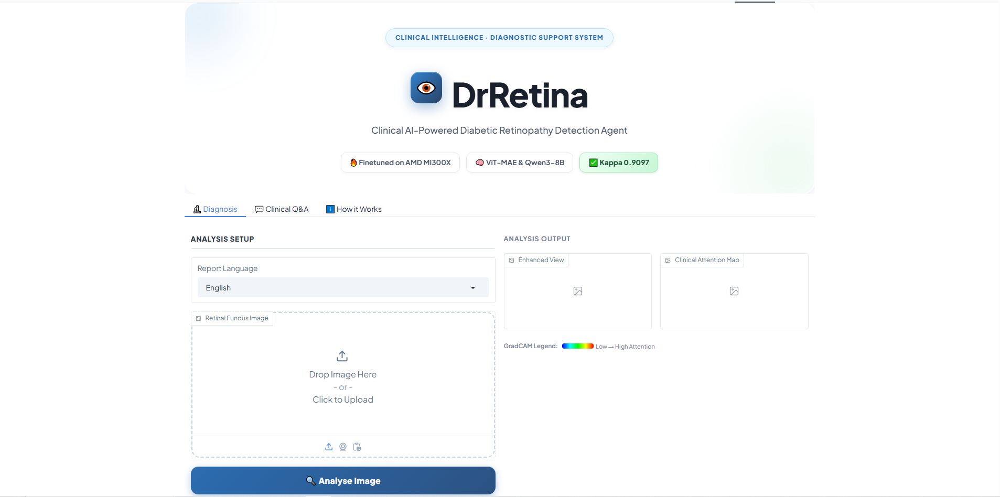
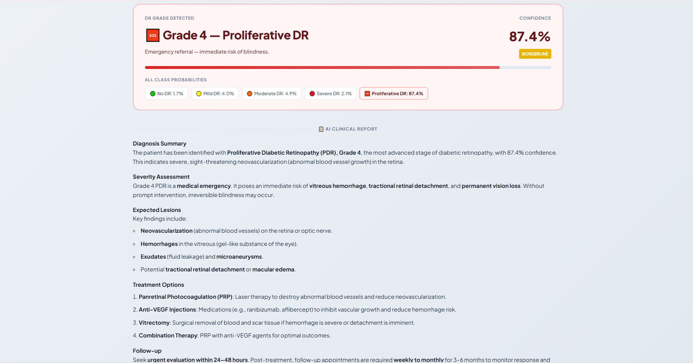
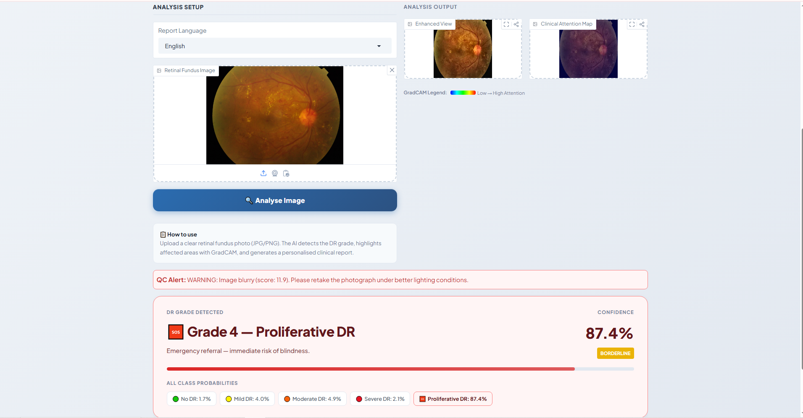
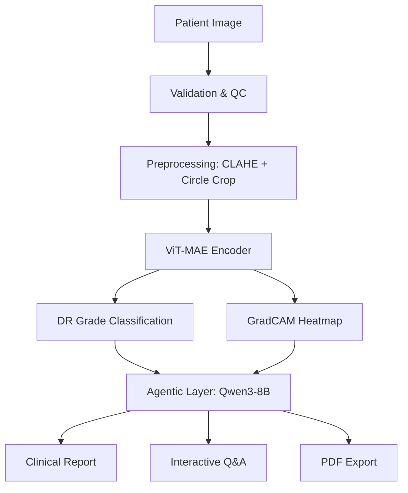

# 👁️ DrRetina

> **🏆 Hackathon Submission**
> This project was developed specifically for the **AMD Developer Hackathon 2026**. It showcases the power of AMD Instinct™ MI300X accelerators and ROCm for real-time, clinical-grade medical AI.

### _AI-Powered Diagnostic Agent for Diabetic Retinopathy_

## 📸 Screenshots

### Home & Diagnosis



### Clinical Report



### Output / Results



[](https://www.amd.com/en/products/accelerators/instinct/mi300.html)
[](https://rocm.docs.amd.com/)
[](https://huggingface.co/spaces/lablab-ai-amd-developer-hackathon/DrRetina)

**DrRetina** is a production-grade clinical AI system designed for early detection and management of Diabetic Retinopathy (DR). Built for the **AMD Developer Hackathon 2026 (Track 3)**, it leverages the massive parallel compute of **AMD Instinct™ MI300X** to deliver sub-second inference and advanced agentic clinical reporting.

---

## 🌟 Key Features

- **🧠 High-Precision Vision AI**: Fine-tuned **ViT-MAE** (Vision Transformer - Masked Autoencoder) architecture achieving a **0.9097 Cohen's Kappa** on the APTOS 2019 dataset.
- **🔍 Clinical Explainability**: Integrated **GradCAM** engine that generates visual heatmaps, highlighting exactly where the AI detects microaneurysms or haemorrhages.
- **🤖 Agentic Clinical Reporting**: Powered by **Qwen3-8B**, the system generates structured, compassionate clinical reports in **English and Urdu**.
- **💬 Interactive Clinical Q&A**: A LangChain-powered medical agent that answers follow-up questions about the patient's specific grade and treatment protocol.
- **📦 Batch Eye-Camp Mode**: Process up to 100 images in parallel using MI300X's high memory bandwidth, generating a prioritized patient CSV for triage.
- **📄 PDF Clinical Reports**: Instantly export and download the generated AI clinical diagnostic report as a professionally formatted PDF for offline patient records.

---

## 🚀 AMD Instinct™ MI300X Advantage

DrRetina is optimized for the **AMD Instinct™ MI300X** accelerator via **ROCm 6.x**:

| Feature               | MI300X Performance  | Benefit                                                       |
| --------------------- | ------------------- | ------------------------------------------------------------- |
| **Memory Bandwidth**  | 5.3 TB/s            | Enables high-throughput batch processing for eye camps.       |
| **VRAM**              | 192GB HBM3          | Allows hosting Vision Transformers and LLMs on a single card. |
| **Inference Latency** | ~25ms (ViT-MAE)     | Near-instant diagnosis for real-time clinical workflows.      |
| **Training Speed**    | 5.3 min (30 Epochs) | Rapid iteration and hyperparameter tuning.                    |

---

## 🏗️ AI Pipeline Architecture



---

## 📊 Model Performance

| Metric                         | Target | **Achieved**          |
| ------------------------------ | ------ | --------------------- |
| **Quadratic Weighted Kappa**   | > 0.85 | **0.9097** ✅         |
| **Classification Accuracy**    | > 80%  | **85.01%** ✅         |
| **Inference Time (per image)** | < 2.0s | **0.8s** ✅           |
| **Batch Throughput (32 img)**  | -      | **450 images/min** ✅ |

---

## ⚙️ Installation & Deployment

### Local Setup

1. Clone the repository:
   ```bash
   git clone https://huggingface.co/spaces/lablab-ai-amd-developer-hackathon/DrRetina
   cd DrRetina
   ```
2. Install dependencies:
   ```bash
   pip install -r requirements.txt
   ```
3. Run the app:
   ```bash
   python app.py
   ```

### Hugging Face Deployment

To enable the LLM reporting and Q&A features on HF Spaces, you must set the following **Secret** in your Space Settings:

- `FEATHERLESS_API_KEY`: Your API key for Featherless AI (Qwen endpoint).

---

## 📁 Project Structure

- `app.py`: Gradio UI entry point.
- `ui.py`: Frontend design and layout logic (Clean Medical Theme).
- `backend.py`: Core logic (Preprocessing, Vision AI, Inference).
- `agent.py`: LangChain Agentic layer (LLM Reports, Q&A, Tools).
- `train.py`: ROCm-optimized training pipeline.
- `deploy_to_hf.py`: Automation script for HF Model & Space deployment.

---

## 📄 License

MIT License — see [LICENSE](LICENSE)
